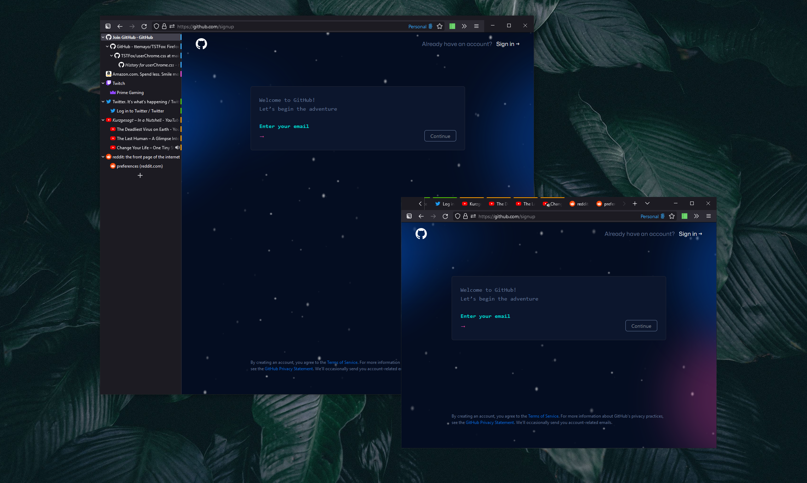

<br><br>

# TSTFox
My personal Firefox custom CSS—designed to remove the clutter that comes default with Firefox, especially when used in conjunction with Tree Style Tabs. The main goal was to maximize screen and browser real estate.

<br>




## Features
### Tabs hidden on top bar
Tabs are hidden because of the redundancy with Tree Style Tabs
```css
#TabsToolbar{ visibility: collapse !important }
```

### Min, Restore, Max, Close toolbar on navigation row
This is to done to increase the compactness of the browser window, for that one-line nav bar.
```css
  #nav-bar {
	margin-right:140px;
  }
  
  #TabsToolbar .titlebar-buttonbox-container {
    visibility: visible !important;
    position: absolute;
    display: block;
    top: 14px;
    right: 1px;
  }
```
### Hide header of 'Tree Style Tab'-Addon
```css
#sidebar-box[sidebarcommand="treestyletab_piro_sakura_ne_jp-sidebar-action"] #sidebar-header {
  display: none;
}
```

### Tabs on Top Breakpoint

Edit the `min-width` value to change the breakpoint size on which Cascade will switch to the oneline layout.

```css
@media (min-width: 1000px) {
    
    [...]
    
}
```

## How to use this userChrome.css

1. Type `about:config` into your URL bar. Click on the **I accept the risk** button if you're shown a warning.
2. Seach for **`toolkit.legacyUserProfileCustomizations.stylesheets`** and set to **`true`**.
3. Go to your profile folder:
    - Linux: `$HOME/.mozilla/firefox/######.default-release/`
    - MacOS: `Users/[USERNAME]/Library/Application Support/Firefox/Profiles/######.default-release`
    - Windows: `C:\Users\[USERNAME]\AppData\Roaming\Mozilla\Firefox\Profiles\######.default-release`
4. If it doesn't exist, create a folder called `chrome`.
5. Copy `userChrome.css` into that folder.

<br>

## To-do
- Update preview to showcase pinned tabs